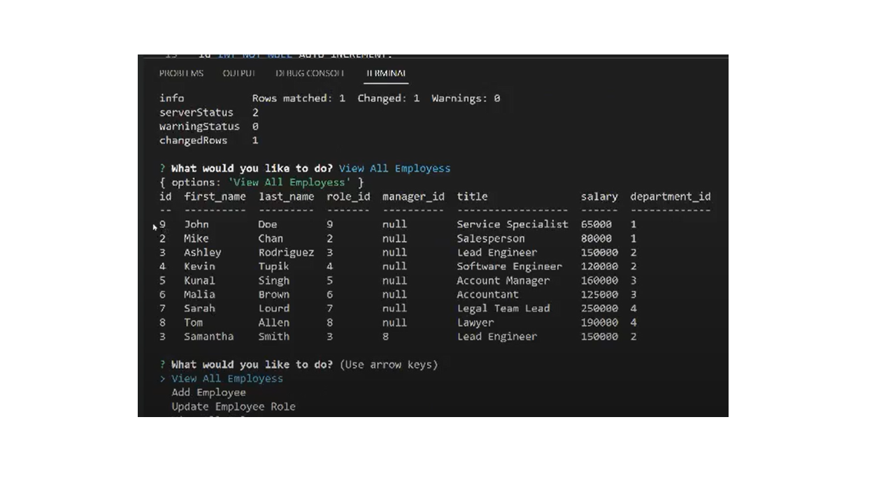

# track_employees
track_employees is a command-line application created to manage a company's employee database, using Node.js, Inquirer, and MySQL.

Link to walkthrough video that demonstrates functionality: <a href= "https://drive.google.com/file/d/1JDplWpnaaeljHHIbYm53u9Hd95OoFbEw/view?usp=sharing">track_employees video</a> 

Application GitHub URL : <a href= "https://github.com/monicadolce/track_employees">Visit Monica's GitHub Repository</a> 